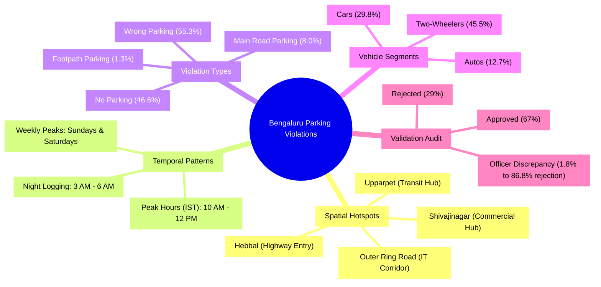

# Data Analysis Report: Parking Violations in Bengaluru

This report analyzes a dataset of **298,450 parking violations** recorded in Bengaluru, Karnataka, spanning from **November 9, 2023, to April 8, 2024** (approximately 5 months). 

The goal of this analysis is to identify key spatial, temporal, and operational patterns of illegal parking to help address the challenge of **Parking-Induced Congestion** and enable targeted, AI-driven enforcement.

---



---

## 1. Key Findings & Overview

- **100% Parking-Related**: Every record in the dataset contains at least one parking violation (e.g., "Wrong Parking", "No Parking", "Parking on Footpath").
- **High Rejection Rate**: Out of the ~172,000 cases that have been validated by authorities, **29% (49,754 cases) were rejected**. 
- **Two-Wheelers Rule**: Scooters and Motorcycles represent the largest group of offending vehicles, combining for **45.5%** of all logged violations.
- **Morning Rush Peak**: Violations peak sharply between **10:00 AM and 12:00 PM IST**, aligning with morning commute hours and the opening of commercial districts.
- **Weekend Spikes**: Sunday (50,162) and Saturday (44,523) see the highest number of violations, likely due to shopping, dining, and leisure traffic in commercial areas.

---

## 2. Violation Type Distribution

The dataset records multiple violations per vehicle event. The table below lists the most common violation types and their occurrence rates:

| Violation Type | Count | % of Total Dataset |
| :--- | :--- | :--- |
| **Wrong Parking** | 164,977 | 55.28% |
| **No Parking** | 139,050 | 46.59% |
| **Parking in a Main Road** | 23,943 | 8.02% |
| **Defective Number Plate** | 7,848 | 2.63% |
| **Parking on Footpath** | 3,757 | 1.26% |
| **Parking near Bus Stop/School/Hospital** | 2,403 | 0.81% |
| **Double Parking** | 2,037 | 0.68% |
| **Parking near Road Crossing** | 1,687 | 0.57% |
| **Refuse to Go for Hire** (Autos) | 887 | 0.30% |
| **Parking near Traffic Light or Zebra Crossing** | 525 | 0.18% |

> [!NOTE]
> Violations like "Defective Number Plate" and "Refuse to Go for Hire" co-occur with parking violations, as the enforcement mechanism records multiple issues during a single parking stop.

---

## 3. Offending Vehicle Categories

Analyzing the vehicle types involved reveals where enforcement should focus:

- **Two-Wheelers (Scooters + Motorcycles)**: **135,667 cases (45.5%)**
- **Cars**: **88,870 cases (29.8%)**
- **Passenger Autos**: **37,813 cases (12.7%)**
- **Commercial Vehicles (Maxi-Cabs, LGVs, Private Buses)**: **21,260 cases (7.1%)**

```
Two-Wheelers:   [====================] 45.5%
Cars:           [=============] 29.8%
Autos:          [======] 12.7%
Commercial/LGV: [===] 7.1%
```

---

## 4. Temporal Patterns (Indian Standard Time - IST)

The timestamps in the dataset were parsed and converted to **IST (UTC+5:30)** to reflect actual local behavior.

### Hour of the Day (IST)
The peak period for violations is mid-morning, with a significant secondary drop in the afternoon before rising again in the evening.

- **Peak Commute**: **10:00 AM - 12:00 PM** (32k+ per hour)
- **Morning Start**: **8:00 AM - 10:00 AM** (25k-27k per hour)
- **Early Morning Spike**: A notable volume of violations is logged between **3:00 AM and 6:00 AM IST** (~21k-23k per hour). This may be due to batch uploads from handheld devices, overnight parking checks, or shift-change data syncs.

### Day of the Week
Violations are heavily concentrated around weekends:
1. **Sunday**: 50,162
2. **Saturday**: 44,523
3. **Thursday**: 43,547
4. **Tuesday**: 42,697
5. **Wednesday**: 41,977
6. **Friday**: 40,864
7. **Monday**: 34,680 (Lowest)

---

## 5. Spatial Hotspots (Illegal Parking Zones)

Grouping by police station jurisdiction and coordinates (rounded to ~110m precision) reveals major bottleneck corridors in Bengaluru.

### Top 5 Police Stations
These five police stations represent **41.4%** of the entire dataset's violations:
1. **Upparpet** (34,468 cases) — Hub of transit (Majestic Bus Station, City Railway Station).
2. **Shivajinagar** (28,044 cases) — Highly congested commercial district and major bus terminus.
3. **Malleshwaram** (22,200 cases) — Traditional market streets (Sampige Road).
4. **HAL Old Airport** (20,819 cases) — Dense IT/office corridor and inner ring road.
5. **City Market** (17,646 cases) — Chaotic wholesale market area with heavy commercial vehicle loading.

### Top 5 Geographic Hotspots (Street Level)
1. **New Horizon College Road, Kadubeesanahalli (Outer Ring Road)**: ~6,200 violations (Embassy Tech Village & NHCE area). A massive tech park corridor known for severe bottlenecks.
2. **Kamaraj Road & Dickenson Road, Shivaji Nagar**: ~5,400 violations. Heavy commercial shopping district near Commercial Street.
3. **Bellary Road, Hebbal**: ~2,600 violations. A major arterial entry point to Bengaluru from the airport, prone to bottlenecking.
4. **MBT Road, Devasandra Junction, KR Puram**: ~3,000 violations. A crucial junction connecting East Bengaluru with the IT corridors.
5. **3rd Cross Road, Chickpete**: ~2,300 violations. Extremely narrow and congested wholesale market alleys.

---

## 6. Validation Audit & Data Quality Issues

An audit of the `validation_status` column reveals significant operational and data quality concerns:

- **Missing Validation**: **42.0% (125,254 cases)** have no validation status, indicating a large backlog of unreviewed cases.
- **High Rejection Rate**: **28.9%** of reviewed cases are marked as **rejected**. This represents wasted patrol resources and device errors.
- **Officer Discrepancy**: Rejection rates vary dramatically by the reporting officer (`created_by_id`).
  - Some officers have nearly perfect approval rates (e.g., `FKUSR01073` has **98.1% approved**).
  - Others have extremely high rejection rates (e.g., `FKUSR02046` has **86.8% rejected** out of 122 cases, and `FKUSR01903` has **82.7% rejected**).

> [!WARNING]
> The wide discrepancy in officer-level approval rates suggests that some hand-held devices are poorly calibrated, or certain officers are incorrectly logging standard parkings as violations, leading to heavy manual processing overhead.

---

## 7. Deep-Dive: The 90/10 Pareto Rule (Massive Hotspot Concentration)

By analyzing the distribution of violations across geographic coordinates, we found a extreme concentration pattern:
- **Location Level**: **9.98% of unique locations** (1,092 out of 10,942) account for **80% of all violations**.
- **Grid-Cell Level (110m resolution)**: **11.66% of unique grid cells** (911 out of 7,814) account for **80% of all violations**.
- **90% Threshold**: Just **21.79% of locations** account for **90% of all violations**.

> [!IMPORTANT]
> **Enforcement Takeaway**: Instead of patrolling the entire city, the Bengaluru Traffic Police can cover **80% of illegal parking incidents by targeting just ~1,000 key locations** (or ~900 110m cells). This makes police resource deployment 8-10x more efficient.

---

## 8. Deep-Dive: Congestion Footprint Impact (PCU Weighting)

While Scooters make up the largest raw volume of violations, their physical footprint is small. A commercial vehicle or car parked illegally on a main road causes a much greater bottleneck. 

To quantify this, we applied **Passenger Car Unit (PCU)** weights (Indian Roads Congress standards) to all vehicle classes to calculate the **Total Congestion Footprint Impact**:
- **Scooters/Motorcycles/Mopeds**: 0.5 PCU (small size)
- **Cars / Autos / Jeeps**: 1.0 PCU
- **Maxi-Cabs / LGVs / Tempos / Vans**: 1.5 PCU
- **Buses / Lorry / Heavy Trucks (HGV/Tanker)**: 3.0 PCU

### Re-ranking of Congestion Impact by Vehicle Type:

| Vehicle Type | Violation Count | % of Raw Violations | PCU Weight | Total Congestion Footprint (PCU) | % of Congestion Footprint |
| :--- | :--- | :--- | :--- | :--- | :--- |
| **CAR** | 88,870 | 29.78% | 1.0 | 88,870.0 | **34.92%** |
| **SCOOTER** | 94,856 | 31.78% | 0.5 | 47,428.0 | **18.64%** |
| **PASSENGER AUTO** | 37,813 | 12.67% | 1.0 | 37,813.0 | **14.86%** |
| **MOTOR CYCLE** | 40,811 | 13.67% | 0.5 | 20,405.5 | **8.02%** |
| **MAXI-CAB** | 11,372 | 3.81% | 1.5 | 17,058.0 | **6.70%** |
| **LGV** | 8,255 | 2.77% | 1.5 | 12,382.5 | **4.87%** |
| **Buses (Private + BMTC)** | 2,914 | 0.98% | 3.0 | 8,742.0 | **3.44%** |
| **Heavy Goods Vehicles (HGV/Lorry)** | 2,266 | 0.76% | 3.0 | 6,798.0 | **2.67%** |

> [!TIP]
> **Key Insight**: While Scooters lead in raw count, **Cars are the single largest source of physical road blockage (34.9% of impact)**. Heavy and medium commercial vehicles (Maxi-Cabs, LGVs, Buses, Trucks) represent only **~8.3% of raw violations**, but cause **~17.7% of the total physical congestion impact**.

---

## 9. Deep-Dive: Systemic Chronic Hotspots (Month-over-Month)

To determine if hotspots are temporary (event-driven) or systemic, we analyzed the monthly data for the 4 full months in the dataset (Dec 2023, Jan 2024, Feb 2024, Mar 2024). 

We found **17 precise 110m grid cells** that ranked in the **Top 50 Hotspots in EVERY SINGLE full month**. These are the "systemic chronic hotspots" of Bengaluru:

| Rank | Location | Police Station | Avg Monthly Violations | Dec 2023 | Jan 2024 | Feb 2024 | Mar 2024 |
| :--- | :--- | :--- | :--- | :--- | :--- | :--- | :--- |
| 1 | **Kamaraj Road, Sri Nagamma Devi Circle** | Shivajinagar | **892.2** | 731 | 952 | 904 | 982 |
| 2 | **New Horizon College Road, NHCE (ORR)** | HAL Old Airport | **762.2** | 365 | 981 | 951 | 752 |
| 3 | **Sahakar Nagar Road, Fortune Acacia** | Kodigehalli | **744.0** | 442 | 868 | 945 | 721 |
| 4 | **6th Main Road, RK Puram (Gandhi Nagar)** | Upparpet | **610.0** | 728 | 624 | 455 | 633 |
| 5 | **New Horizon College Road, Embassy Tech Village** | HAL Old Airport | **533.8** | 323 | 968 | 469 | 375 |
| 6 | **Bellary Road, Vinayaka Nagar (Hebbal)** | Hebbala | **482.8** | 605 | 519 | 390 | 417 |
| 7 | **3rd Cross Road, Kempegowda Extension** | Upparpet | **473.8** | 376 | 648 | 409 | 462 |
| 8 | **Mysore Road, SKR Market** | City Market | **434.5** | 320 | 597 | 362 | 459 |
| 9 | **Unnamed Road, Begur Chikkanahalli** | Chikkajala | **428.2** | 451 | 387 | 394 | 481 |
| 10 | **5th Main Road, KG Circle (Gandhi Nagar)** | Upparpet | **377.5** | 477 | 434 | 239 | 360 |
| 11 | **Chord Road, Manuvana** | Vijayanagara | **358.8** | 436 | 461 | 254 | 284 |
| 12 | **Meenakshi Koil Street** | Shivajinagar | **323.5** | 298 | 437 | 174 | 385 |
| 13 | **AS Char Main Road, Chickpet Circle** | City Market | **316.8** | 373 | 394 | 260 | 240 |
| 14 | **MBT Road, Devasandra Junction (KR Puram)** | K.R. Pura | **280.2** | 223 | 236 | 288 | 374 |
| 15 | **Main Guard Cross Road, Tasker Town** | Shivajinagar | **249.2** | 180 | 372 | 170 | 275 |
| 16 | **Subedar Chatram Road, KG Circle** | Upparpet | **246.0** | 285 | 210 | 211 | 278 |
| 17 | **Dispensary Road, Shivaji Nagar** | Shivajinagar | **209.0** | 179 | 315 | 155 | 187 |

---

## 10. AI-Driven Enforcement & Congestion Mitigation Strategy

Armed with this "gold" analysis, we can implement a highly predictive, targeted enforcement strategy:

1. **PCU-Weighted Hotspot Prioritization**:
   Instead of ranking enforcement zones by count, we rank them by **Total PCU Congestion Footprint**. For example, a street with 20 illegally parked Cars/LGVs takes priority over a street with 30 parked Scooters.
2. **Predictive Guarding (Pre-emptive Patrols)**:
   Since these 17 hotspots are chronic and recur monthly with near 100% predictability, police can station tow trucks/patrols at these locations *just before* peak violation hours (e.g., 9:30 AM).
3. **Targeted Commercial Loading Zones**:
   Zones like City Market and Shivajinagar are driven by commercial vehicle violations (Autos, Maxi-Cabs, LGVs). Establishing designated morning loading/unloading bays (8:00 AM - 11:00 AM) can clear the main carriageways.
